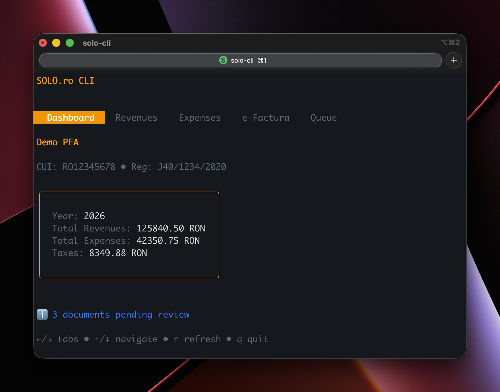
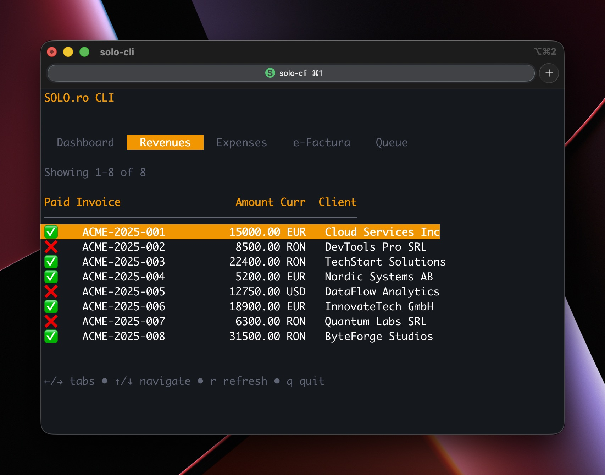
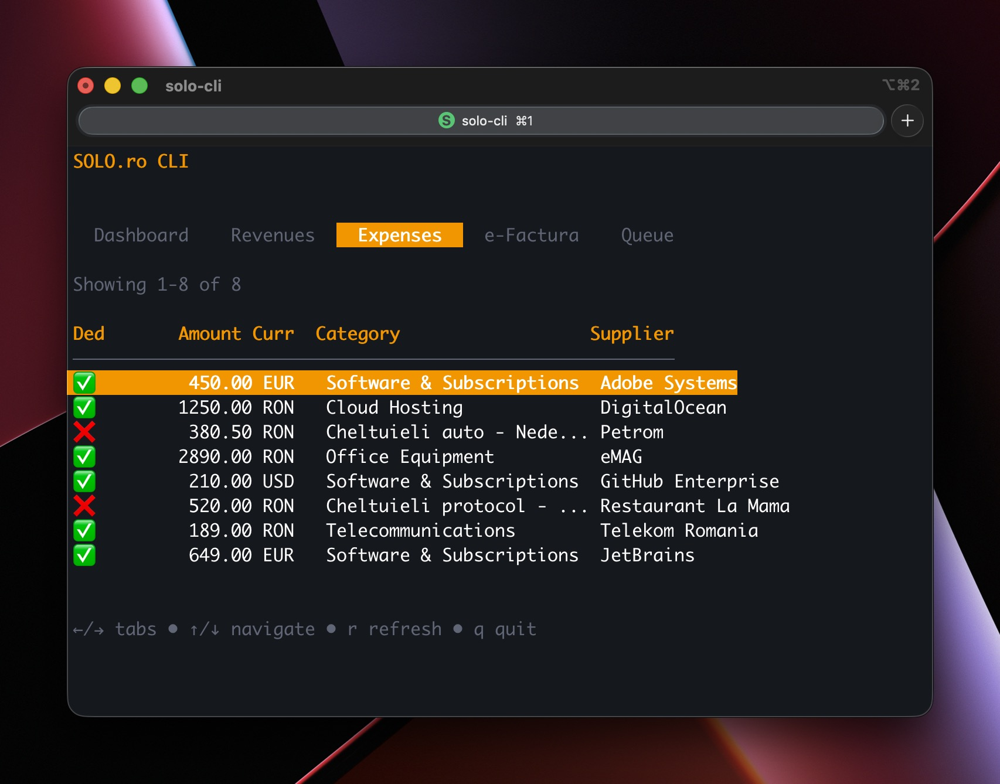
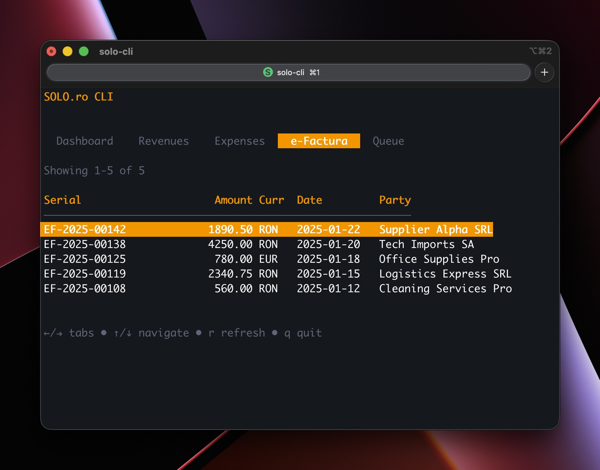
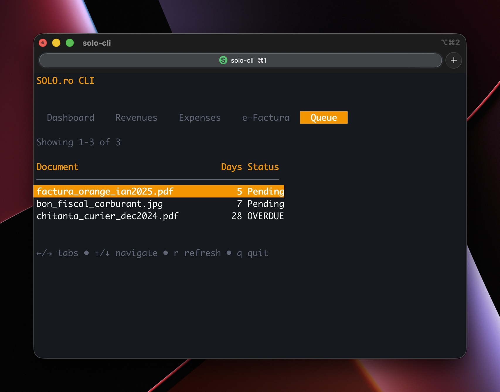

# Solo CLI

A terminal-based user interface for [SOLO.ro](https://solo.ro), an online accounting platform for Romanian freelancers (PFA).



## Features

- 🔐 Secure authentication with SOLO.ro
- 📊 Dashboard with company info and yearly summary
- 💰 View revenues and expenses
- 📄 View e-Factura (national electronic invoicing system)
- 📁 Manage expense queue
- 🍪 Cookie persistence for faster logins

## Installation

### macOS (Homebrew)

```bash
brew install rursache/tap/solo-cli
```

### Windows / Linux / macOS (Go)

```bash
go install github.com/rursache/solo-cli@latest
```

### Build from Source

```bash
git clone https://github.com/rursache/solo-cli.git
cd solo-cli
go build -o solo-cli .
```

## Screenshots






## Configuration

On first run, the CLI creates a config at `~/.config/solo-cli/config.json`:

```json
{
  "username": "your_email@example.com",
  "password": "your_password",
  "company_id": "your_company_id",
  "page_size": 100,
  "user_agent": "Mozilla/5.0 (Windows NT 10.0; Win64; x64) AppleWebKit/537.36..."
}
```

| Field | Required | Description |
|-------|----------|-------------|
| username | Yes | SOLO.ro login email |
| password | Yes | SOLO.ro password |
| company_id | No | Company ID for profile display |
| page_size | No | Number of items to fetch (default: 100) |
| user_agent | No | Custom HTTP user agent string |

### Finding Your Company ID

1. Log in to [SOLO.ro](https://falcon.solo.ro)
2. Go to **Settings → Company**: https://falcon.solo.ro/settings#!/company
3. Open browser DevTools (F12) → **Network** tab
4. Type `company_` in the filter box
5. Look for a request like `company_0e5f5310aec44ea7ba27025d2fd7551c`
6. Copy the ID part (the 32 characters after `company_`)

## Usage

### Interactive TUI Mode

```bash
solo-cli
```

Navigate with keyboard:
- `Tab` / `←` `→` - Switch between tabs
- `↑` `↓` / `j` `k` - Navigate lists
- `r` - Refresh data
- `q` - Quit

**Tabs:** Dashboard → Revenues → Expenses → e-Factura → Queue

### CLI Commands

```bash
solo-cli summary          # Account summary (current year)
solo-cli summary 2025     # Summary for specific year
solo-cli revenues         # List revenues (alias: rev)
solo-cli expenses         # List expenses (alias: exp)
solo-cli efactura         # e-Factura documents (alias: ei)
solo-cli queue            # Expense queue (alias: q)
solo-cli company          # Company profile
solo-cli upload file.pdf  # Upload expense document (alias: up)
```

### Global Options

```bash
solo-cli --help           # Show help
solo-cli --version        # Show version
solo-cli -c /path/to/config.json summary  # Use custom config
```

### Examples

```bash
# Pipe to grep
solo-cli expenses | grep -i "food"

# Use custom config
solo-cli -c ~/work.json revenues

# View past year
solo-cli summary 2024
```

Output is tab-separated for piping to other tools.

## AI Skills

This project also provides a "skill" for agentic AI tools, allowing AI assistants to interact with SOLO.ro on your behalf:

- **GitHub**: [rursache/solo-cli-skill](https://github.com/rursache/solo-cli-skill)
- **ClawdHub**: [rursache/solo-cli](https://clawdhub.com/rursache/solo-cli)

## Acknowledgments

This entire codebase was created using [Claude Opus 4.5](https://www.anthropic.com/claude). Issues and PRs are welcome.

## License

MIT License - see [LICENSE](LICENSE) for details
